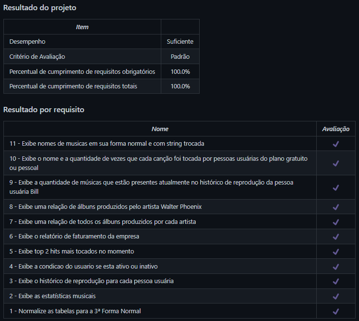

# MySQL One for All
Projeto da [Trybe](https://www.betrybe.com/) - Bloco 21 - Criação de banco de dados, tabelas e queries em SQL.

## 💻 Projeto

Criação de banco de dados, tabelas e queries em SQL utilizando comandos DDL, DML e DQL.

  
<strong>🏆 Meu desempenho</strong>
 

  

## 🚀 Tecnologias
> Este projeto foi desenvolvido com as seguintes tecnologias:

- MySQL

## 📌 Habilidades

> Neste projeto, desenvolvi as seguintes habilidades:

- Normalizar tabelas;
- Utilizar comandos DDL, DML e DQL em SQL;
- Criar bancos de dados e tabelas;
- Criar queries para busca e filtragem de dados;
- Criar queries para inserção, atualização e remoção de dados.

## 💬 Contatos

   
   
  

<!-- ## 📄 Licença

Esse projeto está sob licença. Veja o arquivo [LICENÇA](LICENSE.md) para mais detalhes.

[⬆ Voltar ao topo](#nome-do-projeto)  -->
